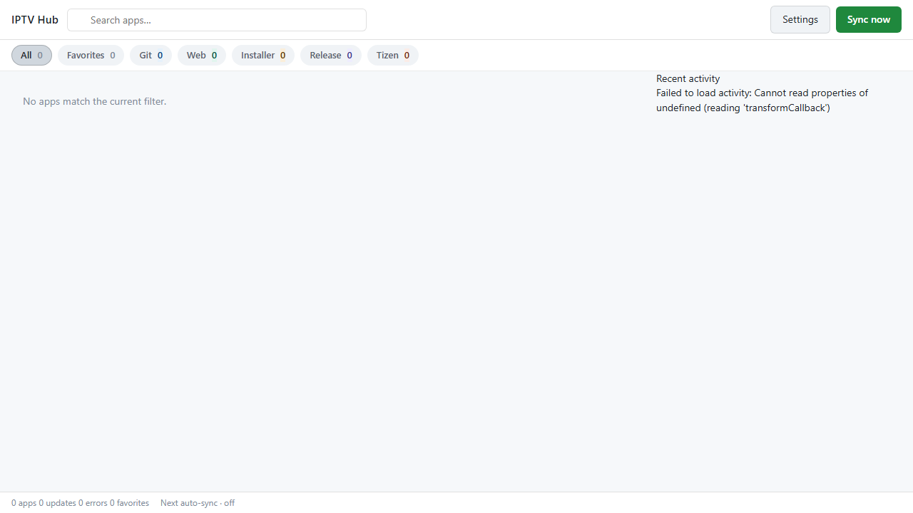
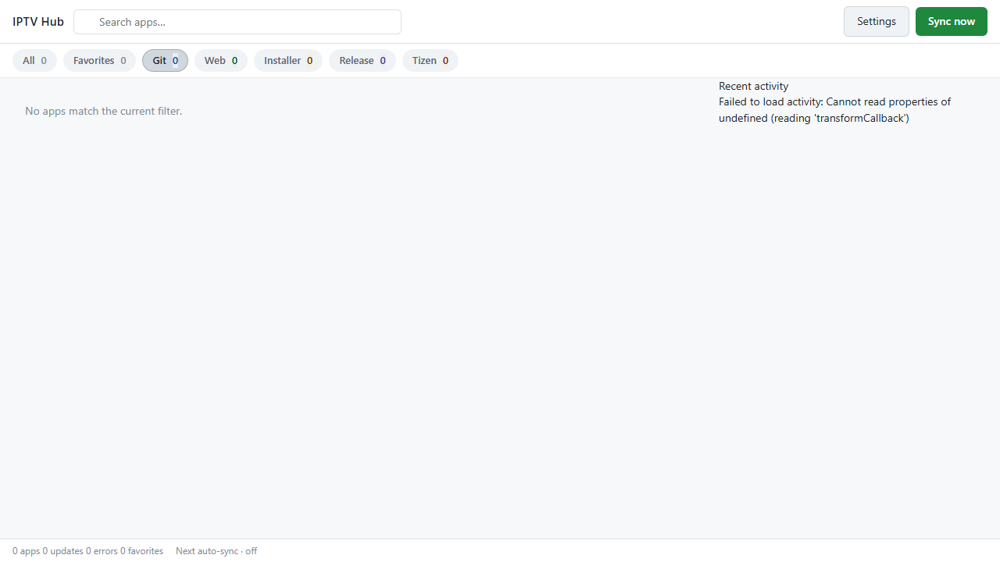
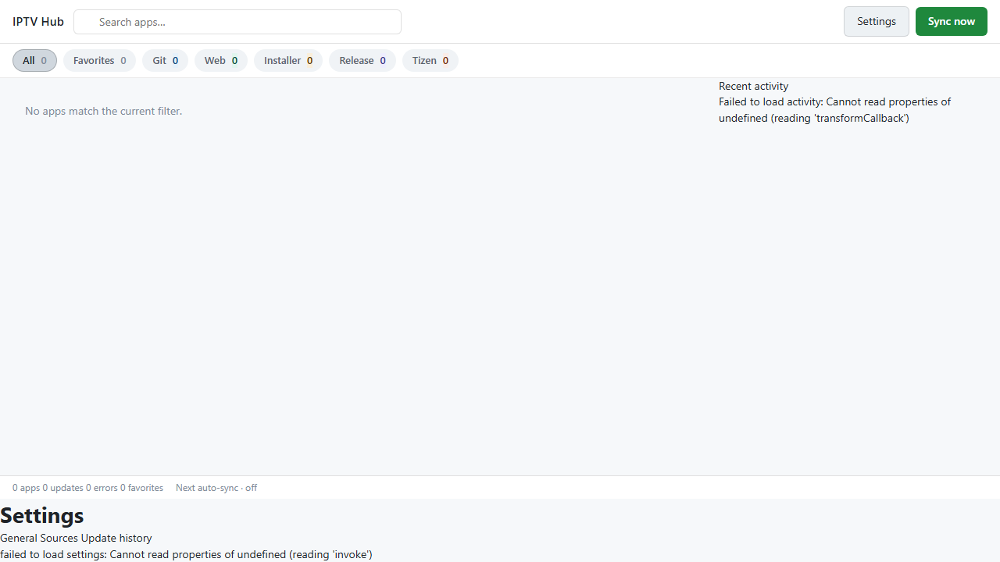
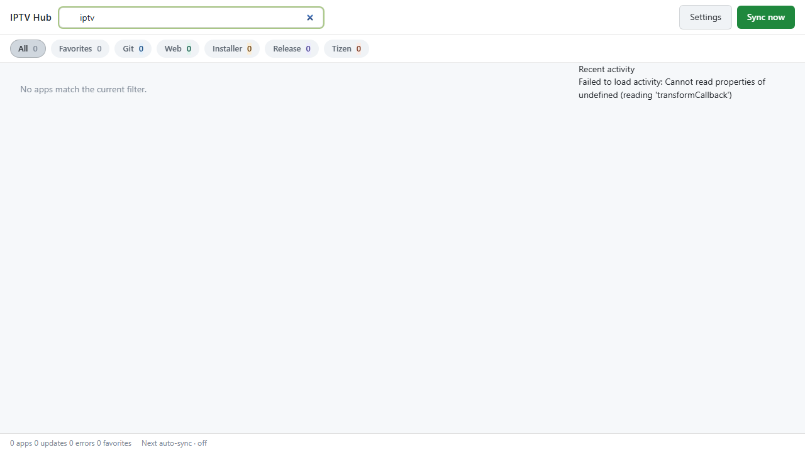
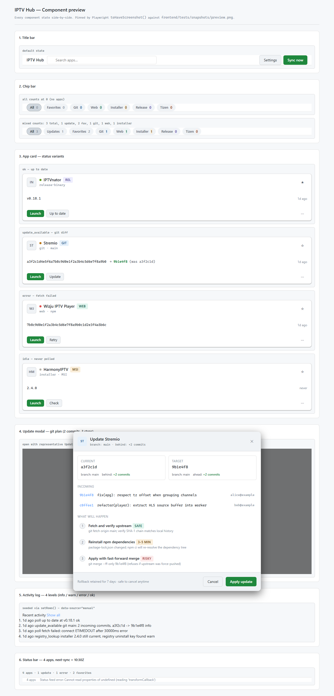

# IPTV Hub — Proof-of-Concept Screenshots

These PNGs are generated end-to-end by Playwright driving a real Chromium against
the real Vite-served frontend. They are **not** mock-ups or hand-edited assets —
they are the actual output of `npm run test:e2e` against `proof-of-concept.spec.ts`,
captured deterministically (animations and transitions disabled via the
`data-e2e-snapshot` attribute applied to `<html>` at screenshot time).

The driver is [`frontend/tests/e2e/proof-of-concept.spec.ts`](../frontend/tests/e2e/proof-of-concept.spec.ts).
Each test loads a known route, performs a known interaction, freezes animations,
and writes a full-page PNG. Re-running the spec on a clean checkout will produce
byte-stable replicas.

> The Vite dev server has no Tauri backend bound, so IPC calls reject and the
> shell renders its **real** error path: empty grid + a banner in the activity
> panel ("Failed to load activity: Cannot read properties of undefined (reading
> 'transformCallback')"). That is the documented no-Tauri-runtime behaviour
> exercised by `shell.spec.ts` as well; it is intentionally **not** mocked.

## 01 — Shell baseline (empty grid, All chip active)



Demonstrates: title bar with branding, search input, Settings + Sync-now actions,
the full chip bar (All / Favorites / Git / Web / Installer / Release / Tizen),
the empty-state placeholder, and the status bar at the foot.

## 02 — Chip filter: Git selected



Demonstrates: chip-bar interaction — clicking the Git chip transitions it to the
active state (`aria-pressed="true"` + `chip--active`). The rest of the shell is
unchanged; the empty grid is what filtering an empty app list looks like.

## 03 — Settings overlay open



Demonstrates: overlay-root mount/unmount pattern. Clicking the Settings button on
the title bar shows the overlay, mounts the settings page, and renders its tabs
(General / Sources / Activity / Snapshots). This is the same code path that
unmount-races used to leak Tauri listeners (fixed in this PR — see commit
`acb6b60` on the `session/2026-05-22-frontend-fixes` branch).

## 04 — Search input bound



Demonstrates: the title-bar's search input accepts user input. The value flows
back to module state via the existing `iptv:search` custom event; the shell
re-renders the (still empty) filtered grid. This screen also verifies the XSS
fix in `main.ts` — `state.search` is now bound to the title-bar attribute via
`setAttribute()`, not interpolated into HTML.

## 05 — Preview gallery (full component matrix)



Demonstrates: `preview.html`, which mounts every shell component side-by-side
with seeded fixtures. Used for visual regression and component-level review.

## 06 — Preview gallery, scrolled to update-modal


The same `preview.html` page scrolled to the update-modal preview section.

---

## How to reproduce locally

```bash
cd frontend
NODE_ENV= npm ci              # NODE_ENV must NOT be 'production' or devDeps are skipped
npx playwright install chromium
NODE_ENV= npx playwright test proof-of-concept
```

Output lands in `../artifacts/screenshots/` (gitignored — committed copies live
here in `docs/screenshots/`). Each test runs in ~0.3–1s on Chromium with the
Vite dev server warm.

If port 5173 is in use, override with `IPTV_HUB_E2E_PORT=5183`.

## CI integration

The CI workflow at `.github/workflows/ci.yml` runs `proof-of-concept` alongside
`shell.spec.ts` as part of the `e2e (Playwright)` job and uploads
`playwright-report/` + `test-results/` as a workflow artifact on failure (14-day
retention). For full proof-bundle handoff, the PNGs in `docs/screenshots/` are
the durable copies.
